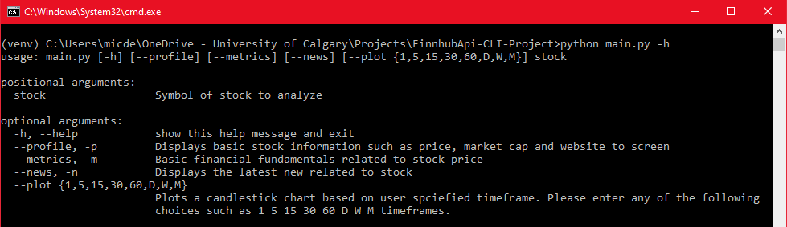
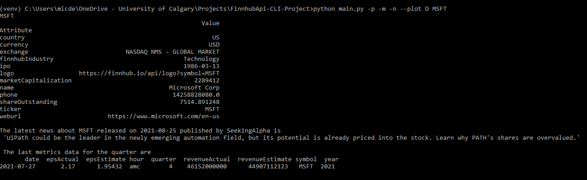
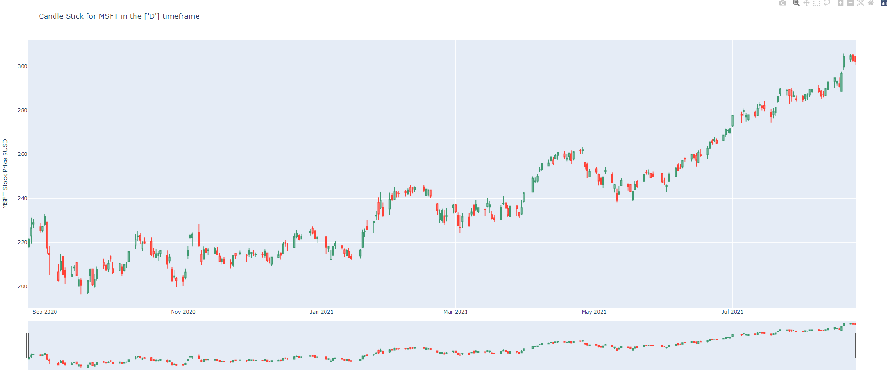

# FinnhubApi-CLI-Project

A command line interface used to pull financial/stock data based on user search/criteria.

The program uses the publicallly available API from finnhub, and is mainly use to demonstrate my ability to code Command line interface programs, to make programs with API's and keep clean and reusable code using SOLID principles in python.

The API Is available at: https://finnhub.io/

The Documentaton is available at: https://finnhub.io/docs/api/introduction

Library used: Argparse, Requests, plotly, Pandas, datetime, finnhub-python ..etc

# What it can do

Currently The CLI can print basic stock fundamentals, the latest news, and some basic information concerning the company of any given stock.

It can also generate a candlestick plots based on latest price action data.

# To get started.

1. Clone the repostiory
2. pip install -r requirements.txt (I reccomend using a virtual env to avoid cluter)
3. Get an API key at https://finnhub.io/dashboard
4. Save the API key in a file called config.py (i.e. API.KEY = c1231231226e3eejh0)
5. Run the program or use the -h toggle to get instructions :)

## Quick note: Using finhubb python vs API calls with Request

Throughout the project, finhubb api library will be used over conventional requests calls.

For example finhubb python library allows us to use:

```python:

import finnhub
finnhub_client = finnhub.Client(api_key=config.API_KEY)
param = {'symbol': "GOOG"}
finnhub_client.company_profile2(param)

```

instead of using conventional api requests

```python:

import config
import requests

# Setting APIkey from config file
header = {'X-Finnhub-Token': config.API_KEY}
# Setting Parameters. Possible parameters/args for profile2 is symbol, isin and cusip.
param = {'symbol': "GOOG"}

response = (requests.get(
    # Endpoint for getting financial overview of stock
    url = config.BASE_URL + "/stock/profile2?",
    # Header for API key
    headers=header,
    # Parameter providing which stock
    params=param
    ))

```

# Results

Below are a few screenshot showing some of the use cases of the program

The help toggle as well as the current options


An example run



To view the html:
[HTML Page of Plotly Output](screenshots/result3.html)

# To do next:

1. Adding more toggles and more functionality.
2. Adding technical indcators and generating support/resistance lines from price action.
3. Alerts based on price action.
4. Webhooks to constantly pull latest stock price.
